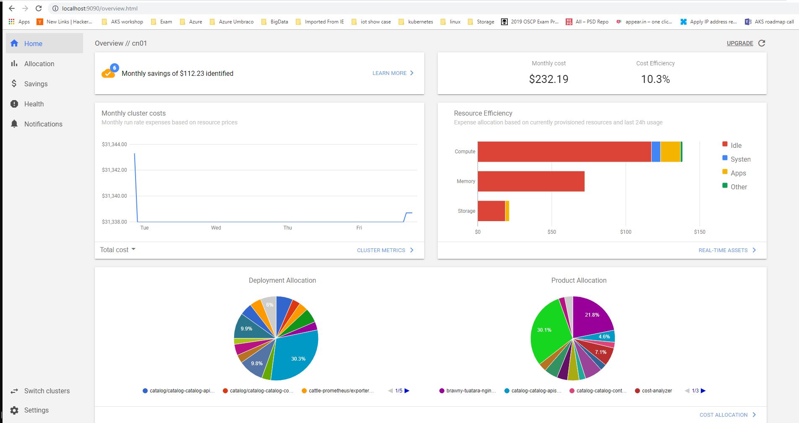

A lot of our enterprise customers would like to manage the cost of their AKS clusters and enable chargeback for the internal teams in the organization. Kubernetes enables us to do so via the metrics API which can consumed by a user or controller in a the cluster to make decisions.

> - [The Metrics API](https://kubernetes.io/docs/tasks/debug-application-cluster/resource-metrics-pipeline/#the-metrics-api)
> - [Metrics Server](https://kubernetes.io/docs/tasks/debug-application-cluster/resource-metrics-pipeline/#metrics-server)

Normally there are two main cases when it comes to internal billing or chargeback:

1. when the customer decide to isolate each team in a seperate cluster completely and in that case it's easy to monitor their consumption and compute usage via [Azure billing](https://docs.microsoft.com/en-us/azure/billing/billing-getting-started) on the Resource group(s) hosting the AKS cluster and the complementing components.
2. when the customer decide to use namespaces in the same cluster to logically isolate teams and in that case Azure billing won't be able to support since it doesn't have visibility on the namespaces in each cluster and for that case in specific we will need to install Kube-cost in your cluster to enable us to view the cost spending and compute usage per cluster/namespaces/nodes/pods.



### Tasks

#### Create a cluster role bindings in case you have RBAC enabled



```sh
kubectl create clusterrolebinding cluster-admin-binding --clusterrole=cluster-admin --user=<your-userid>
kubectl create clusterrolebinding cluster-self-admin-binding --clusterrole=cluster-admin --serviceaccount=kube-system:default
```



#### Use helm to install Kubecost



```sh
helm repo add kubecost https://kubecost.github.io/cost-analyzer/
helm install kubecost/cost-analyzer --namespace kubecost --name kubecost --set kubecostToken="a2Ftb3Vzc0BtaWNyb3NvZnQuY29txm343yadf98"
```



#### Enbale port-forward to view dashboard



```sh
kubectl port-forward --namespace kubecost deployment/kubecost-cost-analyzer 9090
```



#### View the dasboard



Open [http://localhost:9090](http://localhost:9090) in your prefered browser, make sure that you can see your cluster and that you are able to view the usage data of your cluster.



> **Resources**
>
> - [kubecost](http://kubecost.com)